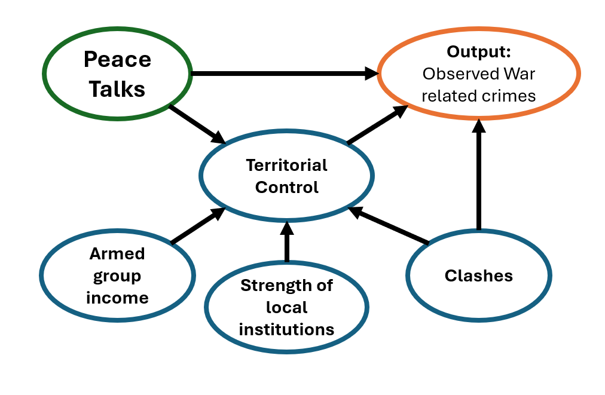
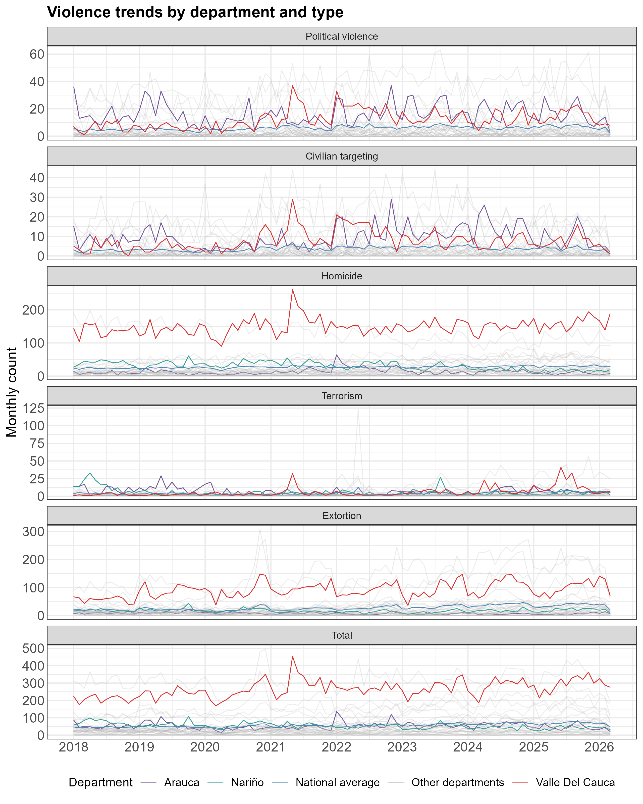
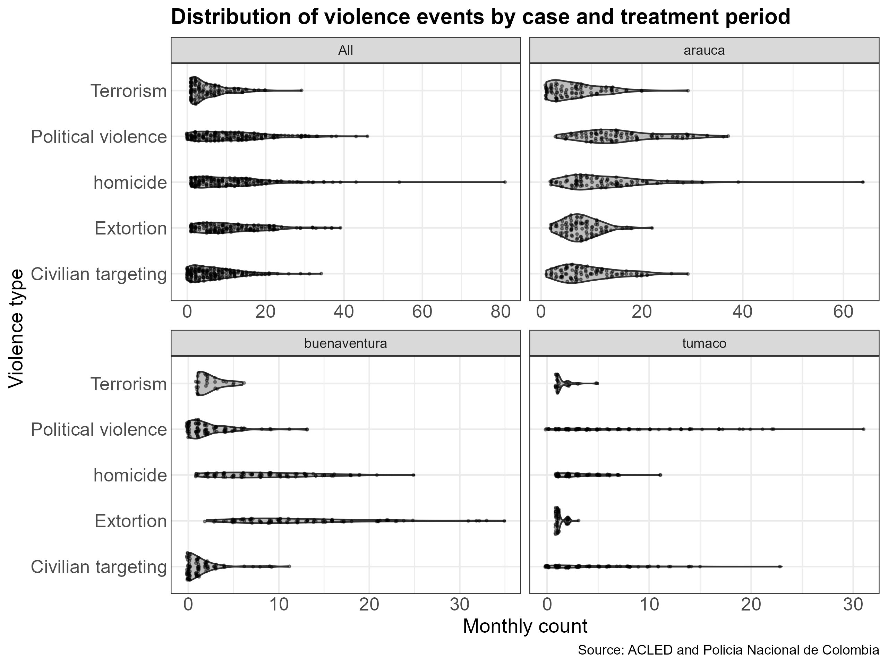
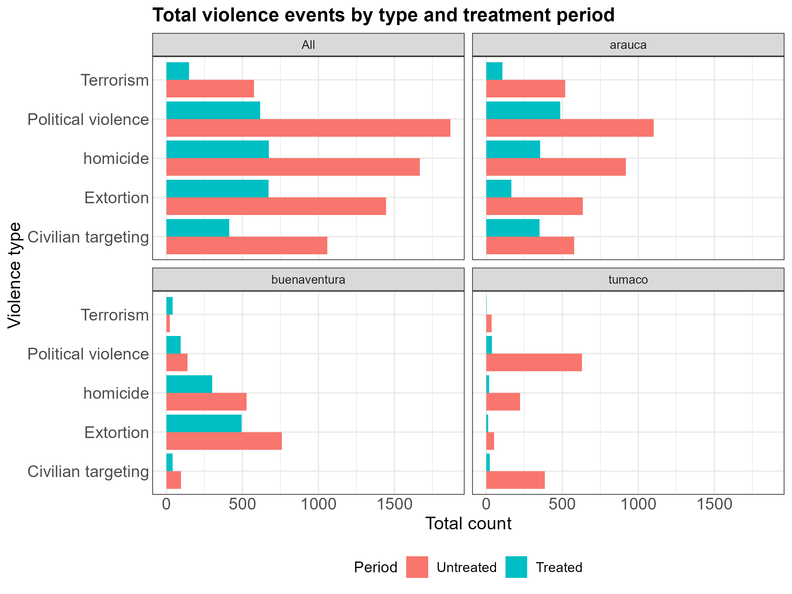
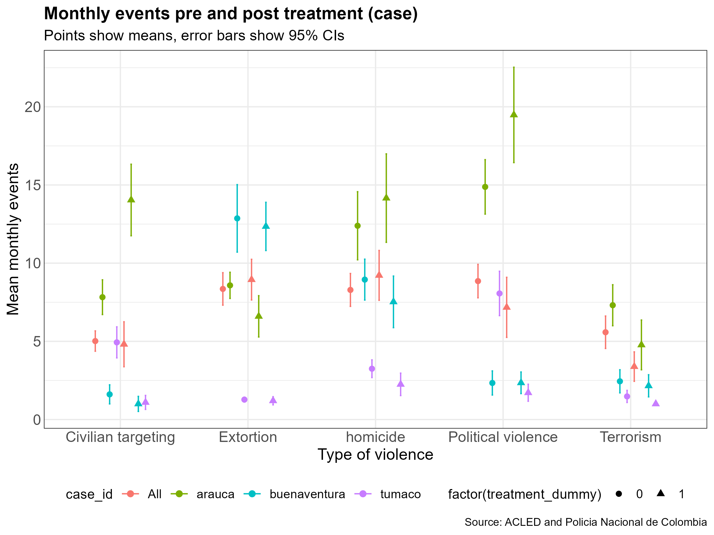
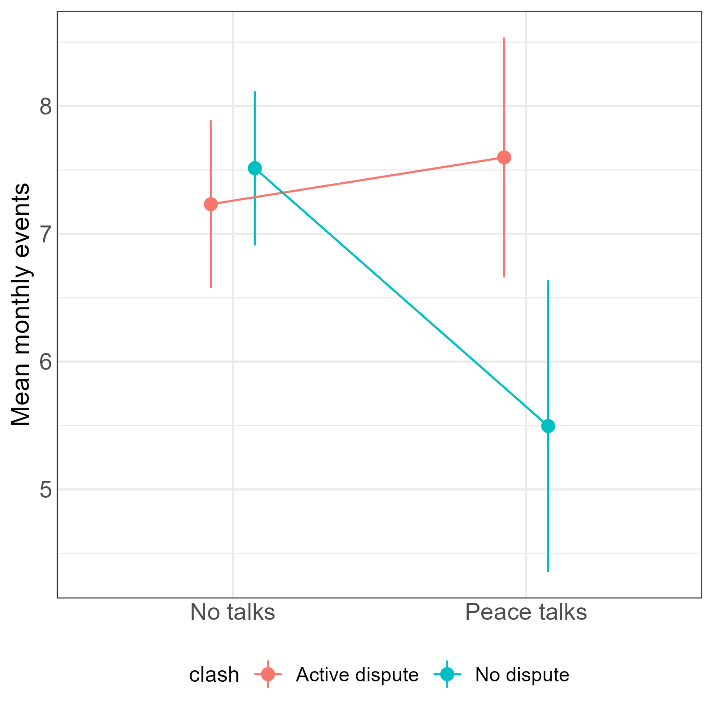
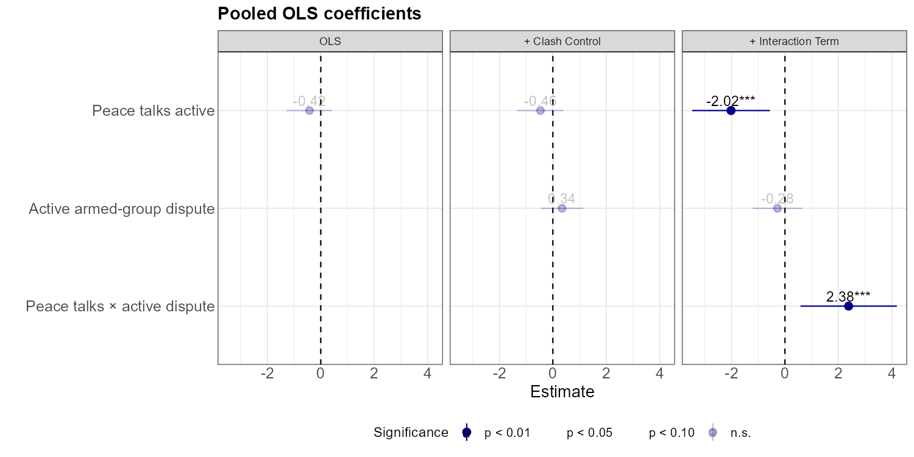
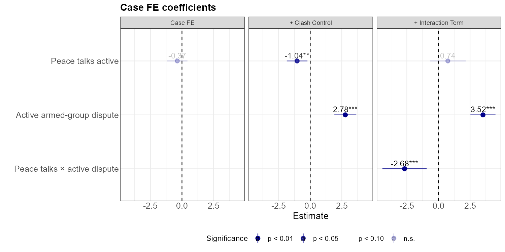
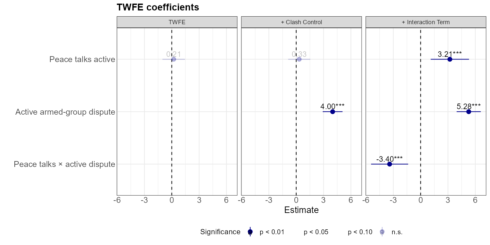
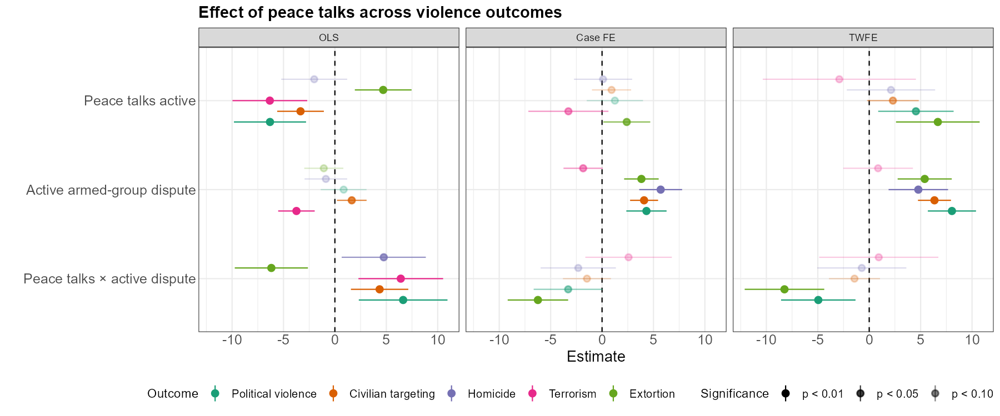

# Paz Total: Quantitative Evaluation of the Política de Paz Total in Colombia

**Daniel Navarro Madriñán**

This thesis examines whether the implementation of Colombia's Poltica de Paz Total (PPT) is associated with changes in monthly violent trends in three territorial cases: Buenaventura, Arauca, and Tumaco. The analysis uses a panel dataset constructed from Colombian National Police records and ACLED event data, aggregating monthly observations of homicides, extortion, terrorism, civilian targeting, political violence, and demonstrations into a single measure of violent exposure. The results indicate that the onset of peace talks is systematically linked to an increase in monthly violence, with political violence emerging as the clearest disaggregated component of this rise, and active armed-group disputes operating as the dominant non-treatment driver.

As the 2022-2026 administration of President Gustavo Petro approaches its end, the outcomes of Colombia's Política de Paz Total have become a matter of growing political and academic interest. One of the central promises of the Petro government was to reduce armed violence across the country by opening simultaneous peace talks and local negotiation processes with insurgent and criminal organizations. These processes sought to reduce confrontation, promote ceasefires, and create conditions for broader demobilization or negotiated settlement. Yet public debate and much of the existing qualitative assessment suggest that the policy has produced mixed and often disappointing results.

This thesis contributes to that debate by providing a quantitative analysis of subnational variation in violence during the implementation of Paz Total. It examines whether the onset of peace talks is associated with changes in monthly violent trends in three territorial cases: Buenaventura, Arauca, and Tumaco.

The analysis uses a panel dataset constructed from Colombian National Police records and ACLED event data, aggregating monthly observations of homicides, extortion, terrorism, civilian targeting, political violence, and demonstrations into a single measure of violent exposure. Methodologically, the thesis employs two-way fixed-effects models to estimate whether violence changes while peace talks are active, controlling for time-invariant territorial differences and common monthly shocks.

**Keywords:** Politica de Paz Total, Colombia, Peace Process,
Peacebuilding

# Introduction

Colombia has been on an almost continuous internal conflict since it
became a republic. Yet, the last 70 years have been probably the most
marked by internal conflict with a prolonged rebel war that evolved from
an ideological revolution to a cartel war. The appearance of cartels and
drugs in the 80s shifted the logic of the conflict into a series of
conflicts of drug production and economic domination between Organized
Armed Groups (AGs). This kept evolving, allowing the appearance of a
vast range of different AGs, from communist guerrillas to urban gangs
that want to participate in the drug economy.

On 2016 former president Juan Manuel Santos signed a peace treaty in
Havannah between the largest AG in the country, the Fuerzas Armadas
Revolucionarias de Colombia (FARC), marking a milestone in the recent
history of violence. The initial intention was to stop the conflict
against the FARC, and initiate an special law for the reintegration of
former combatants into civil life. However, due to failures in the
policy implementation some of the disbanded FARC members dropped their
intentions of returning into civil life and created the so-called FARC
dissidents which include Estado Mayor Central (EMC) and Segunda
Marquetalia (SM), effectively taking back the void positions that were
left from FARC during the peace agreement, and fighting back other AGs
that had begun incursions into the territories such as Ejercito de
Liberación Nacional (ELN). The complexity of the conflict is such that
six years after the 2016 agreement, the International Committee of the
Red Cross still recognized six non-international armed conflicts in
Colombia, including confrontations between the state and irregular
actors as well as conflicts among illegal armed organizations themselves
(Grasa, 2022, p. 4, author's translation).

With this light context in mind, it can be argued that violence in
Colombia is geographically uneven, organizationally fragmented, and
historically persistent. The current cycle of violence is marked by
fragmentation, sub-nationalization, and the increasing importance of
localized interactions among armed actors rather than a single national
logic of war (Valencia and Serrano, 2025, pp. 141-145). It resists
simple dichotomies: it is simultaneously local and global, and cannot be
reduced to rigid categories such as political versus criminal violence
(Gutiérrez Sanín and Sánchez Gómez, 2006, pp. 8-10). The 2016 agreement
did allow "multiple regions of the country to experience peace after
decades of absence" (Johnson et al., 2025, p. 7, author's translation),
but the conflicts initiated by the void left by FARC eventually lead to
increased violence. This is consistent with Pécaut's long-run reading of
the Colombian conflict, which emphasizes the exceptional continuity of
armed organization and notes that the FARC maintained both "longevity"
and "cohesion" even as Colombia underwent profound social and political
transformations (Pécaut, 2008, pp. 23-24).

Petro's government (2022-2026) inherited a country marked by rising
humanitarian impacts, including the highest recent levels of forced
displacement and confinement, continued killings of social leaders, and
an increase in homicide after a long period of decline at the national
level (FIP, 2023, p. 5, author's translation). Aiming to solve the
violence in one go, the government designed and implemented the Política
de Paz Total (PPT) or in english Total Peace Policy. The policy sought
to negotiate simultaneously with a broad range of actors, including
insurgent organizations and criminal groups, under an ambitious and
territorially expansive peace agenda: the policy initiated 13 peace
talks or simply called Mesas (tables) e.g Mesas Regionales (Regional
Tables) or group specific tables such as Mesa con el ELN (Table with the
ELN). This meant, the policy aimed to negotiate with any type of armed
group, including urban gangs and guerrillas, regardless of the context
specific nuances.

The ambition of Política de Paz Total (PPT) is precisely what makes it
both politically important and analytically difficult: it seeks to
transform criminal activities across territories where armed governance
takes very different forms. Henceforth, Paz Total requires "an integral
and multi-actor approach," one that combines the reduction of direct
violence through negotiated agreements with broader peacebuilding
efforts aimed at structural causes of violence (Grasa, 2022, p. 1,
author's translation). This complexity, might be what has brought so
many difficulties to its implementation.

When analyzing the overall results of the policy, qualitative
assessments tend to conclude that the policy has, opposite to its
intentions, increased violence across territories and helped the AGs
reconfigure and expand their operations (Swissinfo, 2026; Leon, 2026;
FIP, 2026). However, there is no quantitative research on this matter,
and hence no evidence that can back up the empirical findings of
qualitative assessments.

Following the work from SOC-ACE (Jhonson, et. al 2026), and considering
that peace talks may alter violent trends because negotiations change
the strategic environment in which armed groups operate, this thesis
aims to quantitatively test these claims by posing the following
question: Within Buenaventura, Arauca, and Tumaco what is the
association between the timing of Petro's Total Peace policy (2022-2026)
negotiations and the monthly incidence of conflict-related events
(homicide, extortion, terrorism, civilian targeting, and political
violence)?

Having these three examples helps understand the policy mechanism in a
more generalized scope, while keeping case specific traceable nuances
that are added into the main model specification. Buenaventura,
Colombia's main Pacific port, is an urban setting marked by criminal
governance, extortion, and territorial rivalry between Los Shottas and
Los Espartanos. Arauca, an eastern border department, has a long history
of insurgent organization, particularly through the ELN's Frente Domingo
Laín, and is shaped by broader regional dynamics linked to the
Venezuelan border, oil rents, and inter-group confrontation. Whereas
Tumaco, located on the southwestern Pacific coast in Nariño, is embedded
in coca-growing corridors, riverine routes, and fragmented armed orders
associated with FARC dissident structures and the Segunda Marquetalia.
Qualitative results provide a base and a mechanism that helps understand
changes in data. For example, the fall of homicides in Buenaventura
after the ceasefire of Los Shottas and Los Espartanos is explained in
the article, while it is also pointed out that the violent mechanism has
shifted from homicides and shootings to forced disappearance. Thus, the
scope of the thesis is deliberately limited. It does not evaluate the
entire national policy, nor does it attempt to explain every armed
process opened under Paz Total. But it reveals a more complex mechanisms
that are contributing to the impacts of the policy.

Methodologically, the thesis measures the impact of the policy by using
a monthly panel constructed from Colombian National Police and ACLED
data. The outcome is an aggregate monthly count of violent observations,
combining homicides, extortion, terrorism, civilian targeting and
political violence and into a single indicator of local exposure to
coercion. This design allows the analysis to capture changes in the
broader observable repertoire of violence rather than focus exclusively
on one category such as homicide, and to provide another insight on the
overall impact of the policy.

The main model specification is a Two Way Fixed Effects (TWFE) that
checks changes with territorial-case and month fixed effects. Allowing a
more heterogeneous perspective, obtaining coefficients that explain a
broad range of armed governance and war related violence during
treatment periods. The model makes each case compare against itself over
time while absorbing shocks common to all cases in a given month. The
estimate of the effects of Paz Total will help assess whether peace
talks are associated with shifts in violence in three theoretically
contrasting territories.

Furthermore, there are data limitations to this research. First, the
analysis cannot capture all forms of coercion equally well due to data
constrains. Practices such as forced disappearance, forced recruitment,
massacres, and many forms of displacement fall out of scope. This
matters because these practices remain central to the contemporary
Colombian war. Valencia and Serrano explicitly identify "child
recruitment, confinements, and extortion" as part of the less visible
effects of current violence (Valencia and Serrano, 2025, p. 143). Hence,
this will only achieve a limited comprehension of the violent outcomes
in the conflict that follow institutional reporting.

Second, the study relies on only three territorial units, which limits
partially inferential power and requires cautious interpretation of
fixed-effects estimates. Third, because Paz Total remains an ongoing and
unfinished policy process, the findings should be understood as an
assessment of changes during implementation rather than as a final
evaluation of negotiated peace outcomes. The thesis therefore measures
important observable dimensions of violence, but it does not claim to
capture the full range of coercive practices through which armed actors
govern territories and populations.

The remainder of the thesis proceeds with seven chapters as follows.
Chapter [2](#theoretical-framework) will argue that violence should be
understood as an instrument of territorial control and governance and
that the effects of peace talks depend on timing, sequencing, and local
armed order, and review literature that showcases qualitative results of
PPT. The [3](#research-design) chapter will provide
[3.1](#research-question),
[3.2](#Methodology-variables) and empirical strategy, explaining
the panel structure, treatment coding, and the logic of the two-way
fixed-effects models, followed by the
[3.3](#assumptions).
Chapter [4](#exploratory-data-analysis) will contain the exploratory
results of violence across the country, region and selected cases and
primary statistical results, with descriptive statistics that shows how
Buenaventura and Tumaco experience declines in average violence during
treatment months whereas Arauca shows an increase, although that is
misleading when accounting for the fixed effects. The following section,
[5](#Results) will provide the
results for each of the implemented models with a description of
limitations, accepting the thesis hypothesis and quantitatively
supporting qualitative assestments.
[6](#Discussion) will come
back to the theoretical implications of the results, and finally
[7](#conclusion) will
outline the implications of these results and propose steps for future
research.

# Theoretical Framework

This thesis understands violence not simply as an episodic outcome of
armed conflict, but as a mechanism through which armed groups govern
territory, discipline populations, and manage competition. Johnson et
al. (2025) state that "violence is the central factor for understanding
how armed actors control and govern territories and local societies"
(p. 23, author's translation). We can understand violence from a broad
set of categories. Pierre Bordeau (1994) defines three types of
violence: symbolic violence, objective violence and subjective violence.
The first, is based on oppression and dominance. Applied through
symbols, discourses, policies and cultural values that have an effect on
subordination. Nonetheless, Žižek (2010), although agrees with this
differentiation proposes a binary classification where symbolic violence
is part of subjective violence.

Under this framework, Žižek (2010) explains objective violence as the
violence that is directly manifested on our daily life: attacks,
homicides or forced displacement. Whereas symbolic violence is that
expressed through language, inequality and societal configuration. Under
these terms, this thesis studies the output of violence as count of
objective violence events in a month.

It includes coercive practices aimed at enforcing rules, punishing
disobedience, and shaping local order, homicides, political violence,
civilian targeting, terrorism and extortion. This logic is consistent
with Arjona's argument that "when armed groups control a territory and
pursue long-term goals, they prefer to create rebelocracies. If they
encounter a community that is likely to resist collectively, however,
they are likely to limit their rule, establishing aliocracy instead"
(Arjona, 2016, pp. 100-101). It is also consistent with Masullo's claim
that civilian agency "can affect the level of violence that armed groups
inflict on civilians..., the distribution of territorial control and the
establishment of rebel governance" (Masullo, 2020, pp. 2-3). For this
reason, homicide, extortion, terrorism, civilian targeting, and
political violence are observable expressions of how armed actors
compete, regulate, and govern.

The argument of this thesis is that peace talks may alter violent trends
because negotiations change the strategic environment in which armed
groups operate. Johnson et al. (2025) emphasize that "timing and
sequencing are key factors in the development of dialogue processes"
(p. 6, author's translation). More specifically, they argue that
"starting with a ceasefire and then negotiating and reaching an
agreement is not the same as beginning with a 'punishment or reward'
strategy (negotiating during war) and then silencing the guns" (Johnson
et al., 2025, p. 20, author's translation). This insight is central to
the causal mechanism of the thesis. Peace talks can reduce some forms of
violence by lowering direct confrontation, signaling restraint, or
stabilizing territorial boundaries. At the same time, they can increase
or transform other forms of coercion if armed groups use negotiations to
strengthen local rule, consolidate extortion markets, or regulate
civilian behavior under reduced military pressure. The hypothesis of
changing violent trends therefore does not assume that peace talks
automatically reduce violence; rather, it assumes that they can
reconfigure its level, form, and territorial distribution.

In this framework, the count of events should be understood as an
approximation of the scale of the problem rather than as a direct
measure of the gravity of each act. Counting armed events, homicides,
extortion, and related forms of violence captures the population's
exposure to coercive dynamics, even though each event is treated equally
in the measurement strategy. The underlying argument is that a reduction
in violence should be understood as a reduction across violent
repertoires, rather than as a utilitarian exchange in which one violent
mechanism is merely replaced by another. In Buenaventura, for example,
the decline in homicides during the ceasefire between Los Shottas and
Los Espartanos was reportedly accompanied by an increase in forced
disappearances (Johnson et al., 2025). This cannot be interpreted as an
improvement in the local security situation, although it is also an
outcome that this study cannot fully capture. For that reason, the
inclusion of multiple categories of violence, treated as equally
problematic indicators of coercion, allows for a broader assessment of
the effects of the Total Peace policy.

This expectation is especially strong in contexts where armed groups
possess significant territorial control and differentiated forms of
governance. Johnson et al. (2025) show that these forms vary sharply
across the three study areas. In Arauca, "ELN governance is the most
intense and extensive of the three cases" (p. 23, author's translation),
and later the report notes that "every aspect of peasant society was
mediated and regulated by the ELN's local structures" (p. 37, author's
translation).

In Buenaventura, by contrast, Los Shottas and Los Espartanos "control
the extortion market and security on cocaine trafficking routes, but do
not intervene much more in the life of the local population" (Johnson et
al., 2025, p. 24, author's translation), even though they maintain
control over "the neighborhoods where they operated" (p. 33, author's
translation). Tumaco occupies an intermediate but regionalized position:
armed regulation extends across "the region, including Tumaco,
Barbacoas, Ricaurte and other municipalities" (Johnson et al., 2025,
p. 41, author's translation), while "violence in the region did not
cease; rather, it shifted to the municipalities north of Tumaco" (p. 44,
author's translation).

These differences matter because, as Moreno León (2017) argues, "the
reaction of armed actors toward demonstrations depends on both the
target of those mobilizations and the level of control that armed actors
exert over the territory" (p. 4). Violence should therefore be expected
to respond differently to peace talks depending on whether negotiations
occur in a fragmented criminal setting, a consolidated insurgent order,
or a region where armed governance is expanding through pacts and
territorial reorganization. The framework also implies that resource
income conditions both governance and violence.

In Arauca, Johnson et al. (2025) write that "the military strength of
the FGO comes from its strong ties to the rural population and its
considerable financial resources derived from extortion of the oil
industry" (p. 35, author's translation). In Tumaco, the report explains
that armed actors were "motivated, mainly, by the income generated by
their control over coca crops and illegal gold mines" (p. 43, author's
translation). These rents help armed organizations sustain coercion,
reward followers, and survive negotiation cycles.

For that reason, changes in violent trends during peace talks cannot be
understood only as political effects; they must also be read in relation
to the economic resources that sustain armed governance. Taken together,
this literature supports that violence is a direct manifestation of
territorial control, governance, and armed competition, and peace talks
may change violent trends because they alter the timing, incentives, and
sequencing of coercion. In some settings, negotiations may reduce open
violence by freezing conflict or clarifying spheres of control. In
others, they may displace violence geographically or transform it into
less visible but still coercive practices, such as extortion, civilian
intimidation, or selective enforcement. The empirical question of the
thesis is therefore not whether peace talks are inherently pacifying,
but whether the onset of talks under the Total Peace policy is
associated with a change in the level and composition of violence across
regions characterized by different forms of armed governance.

Yet, the studies around violence and its evolution in the PPT are
limited to qualitative studies and descriptive statistics. The most
thorough research initiative has been done by Johnson et al. (2025) from
the SOCACE (Serious Organised Crime & Anti-corruption Evidence Research
programme) with sponsor from Global Initiative Against Transnational
Crime and CORE Foundation. The authors have been following the policy
since it was first implemented, and they have described this new
approach as one that "promotes simultaneous negotiations with criminal
organizations and political armed groups in order to establish a
complete peace" (Johnson et al., 2025, p. 7, author's translation).
Johnson's articles and other evaluation initiatives tend to conclude
that the policy is either a failure or its impact is heavily limited.

This is aligned with Valencia and Serrano who reinforce this point by
arguing that, in the contemporary conflict, "ideology gave way to a much
more pragmatic vision of the country, its regions, and war," so that
cooperation and confrontation among armed actors are now better
explained by territorial trajectories, material resources, and local
alliances than by ideological commitments alone (Valencia and Serrano,
2025, pp. 41-42, author's translation). At the same time, they warn that
this de-ideologization does not imply a purely criminal war, since many
supposedly criminal actors remain political insofar as they govern
territories, regulate civilians, and intervene in local democratic life
(Valencia and Serrano, 2025, pp. 42-43).

Jonhson from CORE stand at the position where the policy impact results
are limited (Johnson, 2024; Johnson et. al 2025), which aligns with
different older reports that show some overall decreases in violence
across cities like Buenaventura (FIP, 2024). However, these results are
contrasted with more recent evidence that portrays increased violence
across the country (Ambos, 2026; Preciado, 2026) and the later report
from FIP that showcases how the violence has aggravated during 2025 and
2026 (Cajiao, 2026). In general, research sources point towards limited
effects to the policy and even missing instruments for proper impact
measurement (Valencia, 2025)

In general, the policy can be analyzed from different sources. Some of
the most throughout work comes from InSight Crime, that has an entire
series focusing on the milestones of the policy from a journalistic
position (see Insight Crime, Series Especiales: Dificultades y Desafíos
de la Paz Total en Colombia
https://insightcrime.org/es/noticias/series-especiales/dificultades-desafios-paz-total-colombia/),
or the Fundación Ideas para la Paz interactive dashboard, where the
relevant milestones are summarized in a chess table (see FIP, Las
Jugadas de la Paz Total
https://multimedia.ideaspaz.org/especiales/paz-total/index.html).

And even, the policy can be analyzed at the yearly reports of Petro's
presidency from the FIP, where initially expectations seemed to be
fairly positive, but on the latest reports the results are lukewarm at
most (FIP, 2023; FIP, 2024; FIP, 2025). Some journalistic approaches are
less comprehensive, and they label the policy as a failure (Leon, 2026;
FIP, 2026) which seems to be aligned with recent declarations from
Gustavo Petro who also admitted a policy failure (Swissinfo, 2026).
Overall, the panorama does not seem great. However, no literature has
yet assessed the impact outside of interviews and people's perspectives,
or a mere description of the latest trends compared in a year to year
basis.

This thesis then complements the literature by comparing qualitative
results with a causal quantitative analysis. The strength of qualitative
research is that it measures the impact of both objective as subjective
violence. As, individuals will report their feelings which are aligned
to the sociocultural context and shaped by quantitative measurements of
objective violence happening on their surroundings. However, it is
limited by the fact that people might feel like the situation has
changed due to the policy, but it ignores nuances that can be better
measured using causal models.

The idea then is that this thesis will use qualitative observations as
covariates, generating a final model that can measure the impact of the
policy and use both qualitative and quantitative observations across the
selected cases. One example is that the killing of one of the gang
leaders son's in Buenaventura starts a dispute (clash). This pushes an
increase in the homicides during 2023 even with active negotiations
(Johnson, 2026). This change affects people's perspectives into thinking
that the policy is a failure, whereas this same event serves as a
control and interaction for the model that allows to track how the
policy impacts when there are active clashes between armed groups in a
municipality.

The nature of Buenaventura conflict is quite particular. Gangs fight for
urban control, gather money from extorting and the sale of cocaine that
is smuggled into the port or is sent to the north in semi-submersibles.
In this sense, gangs are established as control entities inside the
neighborhoods, but their control mechanisms are limited to these
specific areas. Both objective and subjective violence are prominent in
the city. And the levels of violence are generally high and directed
towards civilian population: homicides, extortion, civilian targeting,
terrorism and even curfews (Sánchez-Garzoli, 2024).

Tumaco, on the other hand, is one of the main production and export
clusters of cocaine in the country where the conflifct between armed
groups has been active since the 90's (Johnson, 2025). These groups are
well established in the region, they depend mainly on cocaine and gold,
and hence their actions shift based on their resource portfolio
(Rettberg, 2016; Crisis Group, 2019). The strong presence and
establishment allows the groups to control the territory without
inquiring in objective violence. Although the clashes are permanent, the
violent trends in the region are downgrading.

On the same line, Arauca's case is also qualitatively explained. The
well established ELN has received a military incursion since 2022 due to
an expansionist leader on from the competing Frente de Guerra Oriental
(FGO) since the initiation of peace talks with the government. So even
with active negotiations, the incursion of other groups are pushing up
the general observations of violent crimes. ELN has presence on several
departments, but their horizontal structure keeps them relatively
separated from their counterparts in other regions (Aguilera, 2006). In
Arauca ELN relies mostly on coca production, immigrant smuggling and
oil. The groups has shown great interest in continuing a peace process,
but internal fights, and clashes with other groups are giving varied
results. It is not clear if the peace negotiations are reducing the
violence in the region.

With the aforementioned, there are limits to how to measure subjective
violence. And the best approaches are usually qualitatative and based on
human perspectives. In this regard, prior studies have concluded that
PPT has likely failed to reduce objective and subjective violence across
the regions, and the timing of the negotiations could have even
propitiated the military expansion of specific groups. In order to test
these claims, this thesis will focus in understanding how PPT has
affected objective violence, by tracing a causal path between the
treatment and the counted observations of political violence, civilian
targeting, homicides, terrorism and extortion. And by doing so, it will
trace if in fact the negotiation timeline has led to a change in
observable violence levels, or if there is not enough evidence to deny
or accept current qualitative results.

# Research Design

## Research Question

Within Buenaventura, Arauca, and Tumaco what is the association between
the timing of Petro's Total Peace policy (2022-2026) negotiations and
the monthly incidence of conflict-related events (homicide, extortion,
terrorism, civilian targeting, and political violence)?

Null Hypothesis (H0): The initiation of formal peace talks in a
municipality has no statistically significant association with the
monthly frequency of specific conflict-related events.

## Methodology and Variables 
Methodologically, the study uses panel data and estimates two-way
fixed-effects models. Two-way fixed models are a preferred tool as they
enable us to address confounding biases that are unobservable but are
common to all observed units (Dayal and Muruguesan, 2023). In this case,
the geographical level fixed effects account for unobserved
time-invariant heterogeneity, while time fixed effects absorb
time-varying (Dayal and Murugesan, 2023). Applied to this study,
territorial-case fixed effects absorb time-invariant characteristics of
each case, including geography, long-run armed-group presence, and local
institutional structure, while month fixed effects absorb shocks common
to all cases, such as macro-political changes, seasonality, and
countrywide security dynamics. The identifying logic is therefore
within-case overtime comparison: the model tests whether violence
changes once peace talks begin in a given case, net of permanent
differences across territories and common shocks affecting all
territories in the same month.

The panel-data is composed of Colombia's violent trends across three
subnational cases: Buenaventura, Arauca, and Tumaco, measured as the
monthly count of violent events. This choice treats event counts as an
indicator of the frequency with which local populations are exposed to
coercive practices. This is especially important in settings where peace
talks may reduce one form of violence while displacing it into another.
For that reason, the analysis uses both an aggregate and disaggregated
outcome.

The disaggregated outcome is composed of 5 variables. Three of them,
`homicides`, `terrorism`, and `extortion` come from police reports
aggregated to the monthly level. Two additional variables come from
ACLED and are likewise converted to monthly counts. `civilian_targeting`
measures the monthly count of reported civilian targeting events.
According to the ACLED dataset definition, civilian targeting includes
violence against civilians events and explosions/remote violence events
in which civilians were directly targeted. Whereas `political_violence`
includes battles, violence against civilians, explosions/remote
violence, and the mob violence sub-event type within riots. The set of
variables are used as monthly counts of observed events rather than
fatalities, and both are harmonized to the same case-month structure.
Whereas, the aggregated variable is just the addition of these five
components.

The outcome variable is a non-negative integer count of monthly events,
which has implications for model specification that are addressed more
fully in the robustness analysis. Cameron and Trivedi (2013) emphasize
that count outcomes are typically right-skewed and overdispersed, with
variance that grows with the mean, characteristics that violate the
homoscedasticity assumption underlying ordinary least squares. While OLS
coefficients remain unbiased estimates of average treatment effects
under panel fixed-effects designs, standard errors and inferential
statistics may be affected by the distributional features of count data.
The thesis therefore retains Fixed Effect OLS as the main specification
given its standard place in difference-in-differences applications and
the directness of its event-count interpretation, but verifies the
substantive findings against a Difference-in-Difference, Poisson and
negative binomial specifications appropriate for count outcomes.

The mechanism of interest is whether the beginning of negotiations
alters the strategic incentives of armed actors and is therefore
associated with changes in the level of observed violence. As Johnson et
al. argue, "timing and sequencing are key factors in the development of
dialogue processes" (Johnson et al., 2025, p. 6, author's translation),
and the implementation of *Paz Total* opened "a window of opportunity
for the emergence, resurgence, or reconfiguration of rebel or criminal
forms of governance" (Johnson et al., 2025, p. 21, author's
translation). In the data, this mechanism is expressed as a change in
monthly violent trends after the onset of peace talks relative to the
pre-treatment period.

The main explanatory variable is `treatment`, a binary indicator coded
as 1 during the months in which the peace talks (tables) or formal
negotiation processes were active in a given territorial case, and 0
otherwise. The treatment is not defined as a final agreement, a
ceasefire outcome, or a successful demobilization, but rather as the
period during which negotiations were underway under the framework of
the PPT, or based on the armed group agreeing to begin the negotiations
and had started reducing military actions even if the table hadn't
officially begun.

The coding of treatment periods relies primarily on Johnson et
al. (2025), and news portals. In Arauca, the treatment begins in August
2022, when negotiations with the ELN resumed under the Petro
administration (Johnson et al., 2025, p. 35), and is coded as ending in
September 2024, when the process was suspended following the ELN attack
on a military base in Arauca (*El Colombiano*, 2024). In Tumaco, the
treatment begins in June 2024, when formal talks with the Segunda
Marquetalia began and included the operational units in Tumaco (Johnson
et al., 2025, p. 43). The treatment remains active through the end of
the observed period because subsequent public reporting indicates
continued dialogue with successor structures (Frente Guerrillero
Oriental) linked to that process (*El País*, 2025; *La Silla Vacía*,
2025). In Buenaventura, the treatment begins in September 2022,
following the initiation of the preliminary negotiation phase between
Los Shottas and Los Espartanos under the broader *Paz Total* framework
(Johnson et al., 2025, pp. 29--30).

A central extension of the baseline design is the inclusion of
time-varying control for armed-group dispute. The variable Clash is
coded as a binary indicator equal to 1 in months in which a territorial
case is experiencing active inter-group conflict and 0 otherwise. This
control is included because changes in violence may reflect not only
negotiation dynamics but also shifts in territorial confrontation among
armed organizations. In substantive terms, control is especially
important for Arauca, where violence rises in the context of an
intensifying dispute beginning in January 2022 (Celis, 2026), and for
Buenaventura, where the intensity of confrontation changes across
periods of conflict and truce (SAGA UNODC, 2024; Reynoso, 2025; RTVC,
2025). Tumaco is coded as exposed to persistent inter-group conflict
throughout the observed period. Including this variable helps separate
the association between peace talks and violence from the association
between violence and active armed dispute.

The study adopts a case-based territorial panel rather than a nationally
pooled design because the relevant variation is local and because the
territorial scale of armed governance differs across cases. This is
based on two facts, one is the policy design itself, the Total Peace
Policy "focuses on how local governance dynamics influence the
implementation of Total Peace and highlights how they differ according
to the local conditions of each region" (Johnson et al., 2025, p. 7,
author's translation). And second, as Colombia cannot be studied as a
homogeneous region. The country is composed by several regions, that are
built as oppositions of the \"center\". These, are a complex puzzle that
has unique ways of governance, crime and even culture (Serge, 2006).

Accordingly, the unit of analysis is a territorial case-month.
Buenaventura is modeled as a municipality-level case because criminal
control is concentrated within the city (Insight Crime, 2025). Arauca is
modeled at the departmental scale because the relevant armed order
extends across the department and is shaped primarily by the Frente
Domingo Laín (Insight Crime, 2026). Tumaco is modeled as a regional
cluster because armed governance and violence spill across adjacent
municipalities (Insight Crime, 2025b). This territorial definition is
methodological rather than merely descriptive: it seeks to align the
spatial scale of the data with the spatial scale at which armed control
and negotiation effects are most likely to operate.

These cases are not treated as interchangeable. Rather, they are
approached as territorially distinct expressions of Colombia's
contemporary armed conflict, each shaped by a different configuration of
governance, dispute, and spatial reach.
the map illustrates this first territorial
distinction by locating the broader geography of armed spillovers and
conflict dynamics in which the three cases are embedded. In line with
Valencia and Serrano's argument that the contemporary Colombian war is
increasingly subnational, the map shows that violence is not organized
through a single national conflict line, but through localized and
regionalized patterns of dispute, coexistence, and dominance (Valencia
and Serrano, 2025, pp. 44-45).

The violent mechanisms will be hence explained in different contexts of
violence: a rebelocracy (Arjona, 2016) in the case of Arauca, as ELN has
been present and taken over power from several years. Criminal
Governance in Buenaventura, as Los Shottas and Espartanos are
controlling, collecting taxes, defining geographical boundaries and
punishing through different mechanisms as explained in Johnson (2025).
And finally, the intermediate case of Tumaco, that is a criminal
governance from a rebel group that has come to certain agreements with
local authorities that would make it to some extend an aliocracy.

  
   <em>Selected areas for analysis. Source: Prepared by the author with ESRI basemap</em>

  
   <em>Cocaine, Seizures and Homicides National, Navarro and Valencia, 2025. Source: Prepared by the author and published on Valencia, 2025</em>

the map complements this discussion by
showing the territorial relationship between homicide rates and illicit
economies, especially coca cultivation and cocaine seizures. While the
national homicide rate may appear relatively stable in aggregate terms,
the regional distribution of lethal violence is highly uneven. In 2024,
departments such as Arauca, Cauca, Valle del Cauca, Putumayo, and Chocó
recorded some of the highest homicide rates in the country,
concentrating violence in peripheral and border territories.

When these patterns are read together with the geography of illicit
economies, a clearer territorial logic emerges: violence tends to
cluster where armed actors compete for control over strategic corridors,
rent-generating markets, and local populations. This is particularly
visible in southwestern and Pacific regions, where coca cultivation,
trafficking routes, and fragmented armed orders overlap.

Map 2 therefore does not merely describe a correlation between
illegality and violence; it helps illustrate the political economy of
territorial competition that underlies the persistence of armed conflict
in places such as Tumaco and, in a different form, Arauca. Taken
together, Maps 1 and 2 provide complementary justification for the case
selection and spatial design of the thesis. Map 1 situates the three
cases within broader patterns of armed spillover, regional dispute, and
differentiated territorial governance. Map 2 shows that these same
territories are also shaped by the spatial concentration of illicit
economies, which increase their strategic value for armed actors and
help sustain violent competition. The two maps thus reinforce the same
analytical point from different angles: Colombia's contemporary war is
territorially uneven, regionally interconnected, and deeply linked to
localized forms of armed governance and illegal accumulation.

The baseline specification is:

$$Violence_{it} = \alpha_i + \lambda_t + \beta Treatment_{it} + \delta Clash_{it} + \theta \left(Treatment_{it} \times Clash_{it}\right) + \varepsilon_{it}$$

where $Violence_{it}$ is the monthly count of violent events in
territorial unit $i$ and month $t$, $\alpha_i$ are territorial-case
fixed effects, $\lambda_t$ are month fixed effects, $Treatment_{it}$
equals 1 in months in which peace talks are active in that case, and
$Clash_{it}$ equals 1 in months with active armed-group dispute. In this
specification, $\beta$ captures the association between peace talks and
monthly violence in case-months without active dispute, conditional on
both fixed effects. The coefficient $\delta$ captures the association
between active armed dispute and violence in non-treatment months, net
of negotiations and fixed effects. The interaction coefficient,
$\theta$, captures the additional association when peace talks and
active armed dispute occur simultaneously. In substantive terms, the
interaction term allows the model to assess whether the association
between treatment and violence differs between periods with and without
clashes.

This design addresses the main sources of bias that fixed effects are
intended to absorb. Armed governance, territorial control, and local
institutional capacity are highly persistent over time and are therefore
plausibly captured by territorial-case fixed effects. At the same time,
common national developments, including changes in the broader
implementation of PPT, military strategy, or macro-political shocks, are
absorbed by month fixed effects. The inclusion of the armed-dispute
dummy additionally accounts for a substantively important time-varying
source of violence that would otherwise risk confounding the treatment
effect. As a result, the empirical strategy isolates whether the
negotiation period is associated with a deviation from the prior violent
trend within each case, net of both enduring territorial characteristics
and contemporaneous conflict dynamics. Standard errors are clustered at
the territorial-case level, although inference must be interpreted
cautiously given the small number of units. The design addresses the
causal path as displayed in figure 1.

  
   <em>Causal Path: Peace Talks affect the Output (Observed War Related Crimes) and the territorial control. Territorial control affects the violent trends in the region, but mainly depends on the overall strength of the armed group, the civilian resistance and the clashes with other groups. Clashes, are affecting the outcome and the territorial control.</em>

## Assumptions

The first identifying assumption is that, conditional on
territorial-case fixed effects, month fixed effects, and the inclusion
of `clash_dummy`, there are no omitted case-specific time-varying shocks
that both affect the onset of peace talks and independently alter
violence in the same period. This is the key assumption that makes the
treatment coefficient interpretable as a within-case association rather
than a simple coincidence. It is plausible to the extent that the most
important persistent differences across cases are absorbed by
$\alpha_i$, and the most important common shocks are absorbed by
$\lambda_t$. The inclusion of `clash_dummy` strengthens this design by
accounting for months in which active armed-group dispute is likely to
affect violence independently of the negotiation process. However, the
assumption would still be threatened if, for example, a major local
security shock in one case simultaneously triggered negotiations and
altered violence through a separate channel that is not fully captured
by the observed clash measure.

A second assumption is limited anticipation. Armed actors should not
systematically change their violent behavior long before the effective
onset of peace talks in ways that would already embed the treatment
effect in the pre-treatment period. This is addressed by initiating the
treatment period once the actors agreed to participate and acted
accordingly, rather than when the negotiation table effectively begun.

A third assumption is that spillovers across the three territorial cases
are limited enough not to invalidate the within-case comparison. This is
addressed in the geographical specification. Moreno's argument is useful
here because he shows that armed actors' responses depend on "the level
of control that armed actors exert over the territory" (Moreno León,
2017, p. 4). If territorial control and violent responses shift across
neighboring areas in direct response to negotiations, part of the
observed effect may reflect displacement rather than a pure local
treatment effect. Hence the importance of generating a regional cluster
depending on the group's presence.

Finally, the specification assumes that the treatment effect is modeled
as an average additive shift during peace-talk months. This does not
mean that the substantive process is simple. On the contrary, the
theoretical framework suggests that negotiations may reduce some forms
of violence but shifting to other under-reported ones such as forced
disappearance. What the additive TWFE coefficient captures is the
average change in aggregate monthly violence associated with the
negotiation period, not the full complexity of all underlying
mechanisms. In the same way, the inclusion of `clash_dummy` should not
be interpreted as fully modeling the entire strategic structure of armed
confrontation. Rather, it controls for one observable dimension of
conflict intensity so that the treatment coefficient is less likely to
absorb violent changes driven primarily by ongoing armed dispute.

This identification strategy is plausible for three main reasons. First,
qualitative evidence suggests that the timing of peace talks was not
determined solely by short-run local fluctuations in violence. Johnson
et al. (2025) show that the onset of negotiations was shaped by a
combination of national political windows, local security crises, and
the willingness of armed groups to negotiate. In methodological terms,
these sources of variation do not all threaten identification equally.
National political windows, such as the launch and prioritization of PPT
affected all cases and are therefore absorbed by month fixed effects.
Local security crises are included in the design through the
`clash_dummy`, limited to public information availability. Armed-group
willingness to negotiate is more difficult to observe directly, but to
the extent that it reflects durable organizational and territorial
characteristics, much of it is captured by territorial-case fixed
effects. For these reasons, the timing of treatment is unlikely to be
systematically driven by unobserved shocks that operate identically
across all three cases.

Second, the potential role of armed-group income is compatible with the
fixed-effects strategy. Gold and cocaine prices are determined in
international markets and cannot plausibly be caused by the onset of
peace talks in Buenaventura, Arauca, or Tumaco. In that sense, reverse
causality from local negotiations to global prices is not a realistic
concern. The more relevant question is whether changes in international
prices may affect local violence and, indirectly, the strategic
incentives surrounding negotiations. This is theoretically possible.
However, because these price series are common to all cases within each
month, their confounding role is addressed through month fixed effects
in the baseline model.

Third, the fixed-effects design is well suited to the main confounders
identified in the literature on Colombian armed conflict. Persistent
differences in institutional quality, state presence, territorial
control, and local social organization are central to explaining violent
variation across territories. Arjona (2016) shows that local
institutional strength shapes how armed actors govern and how
communities resist them, while Gutiérrez Sanín and Barón (2006)
emphasize the importance of territorial control and armed order in
structuring violent dynamics. These are precisely the types of factors
that are likely to remain relatively stable within a territorial case
over the study period and are therefore absorbed by $\alpha_i$, the
territorial-case fixed effects. Likewise, broader policy changes and
common national shocks are absorbed by $\lambda_t$, the month fixed
effects. In this setting, the empirical strategy therefore isolates
whether violence changes within a case once peace talks are underway,
net of permanent territorial differences, common monthly shocks, and the
observed timing of active armed-group dispute.

At the same time, the design is not free from threats. One possible
concern is omitted variable bias from local shocks that coincide with
the negotiation period and independently affect violence. This risk is
especially relevant in highly localized and fluid urban settings such as
Buenaventura, where short-run shifts in gang organization,
neighborhood-level competition, or enforcement practices may alter
violent trends independently of the talks. The inclusion of
`clash_dummy` helps address this concern, but it cannot eliminate it
completely because not every local shock takes the form of an observable
clash period. Tumaco is permanently exposed to clash as this violent
dynamics are constant and under-reported. The risk may be lower in
Arauca, where armed governance is more territorially consolidated, but
it cannot be ruled out.

For these reasons, the two-way fixed-effects model should not be
understood as proving exogeneity, nor as fully eliminating all threats
to causal inference. Rather, it makes the identifying assumption more
plausible by accounting for the most important sources of confounding
highlighted in both the substantive and methodological literature. The
resulting estimates should therefore be interpreted as theoretically
informed within-case comparisons over time. They provide credible
evidence on whether violent trends changed during the period in which
peace talks were active, while still requiring caution about local
omitted shocks, treatment timing, spillovers, and the very small number
of territorial cases.

# Exploratory Data Analysis

The exploratory analysis examines two questions before turning to the
regression results. First, whether the descriptive distribution of
monthly violent events is consistent with the analytical assumption that
peace talks may reconfigure rather than uniformly reduce violence.
Second, whether the descriptive evidence supports including the
interaction between treatment and clash status as a substantively
meaningful component of the empirical strategy.

The monthly panel covers January 2018 to March 2026, with 297
territorial-case-month observations distributed across Buenaventura,
Arauca, and Tumaco. Across the full sample the average monthly count of
total events is 31.07, with a standard deviation of 22.74 and a maximum
of 137 events. As table 1 already showed, the three cases enter the
period of analysis at very different baseline levels. Arauca exhibits
the highest average monthly violence and the largest dispersion,
Buenaventura sits in an intermediate range, and Tumaco shows the lowest
mean count. These differences are consistent with the territorial
heterogeneity emphasized in the theoretical framework, where each case
represents a distinct configuration of armed governance: a consolidated
insurgent order in Arauca, a fragmented criminal governance in
Buenaventura, and a regionalized armed control structure in Tumaco.

## National and departmental context

Before focusing on the three study cases, it is important to situate
them within the broader national distribution of violence. Figure
[4](#fig:national_department_trends) presents monthly counts of
each violence type across all Colombian departments, with Arauca, Nariño
(where Tumaco is located), Valle del Cauca (where Buenaventura is
located), and the national average highlighted against the rest of the
country.

  
   <em>Violence trends by department and type, January 2018 to March 2026. Source: Prepared by the author with ACLED and Policía Nacional de Colombia data.</em>

The figure reveals two patterns that justify the case-based design of
the thesis. First, Valle del Cauca stands out as a national outlier in
homicide and extortion counts, reflecting the concentration of urban
criminal markets that includes Buenaventura but extends far beyond the
municipality itself. Second, the violent dynamics of Arauca and Nariño
remain closer to the national average in absolute terms, but they
exhibit different trajectories than the rest of the country,
particularly in political violence and civilian targeting. These
departmental trajectories support the analytical decision to study the
three cases as territorially distinct units rather than as elements of a
homogeneous national process. The aggregate national patterns also
confirm that violence in Colombia remains regionally uneven and
persistent throughout the observed period, which is consistent with the
literature reviewed in the introduction.

## Distribution and total exposure across cases

Figure [5](#fig:violin_by_case) presents the marginal distribution of
monthly counts for each violence type within each case. The
distributions are heavily right-skewed and bounded at zero, with most
months concentrated near low values and a small number of months showing
extreme counts. This shape is consistent across cases and across
violence types, although the magnitudes differ substantially.

<figure id="fig:violin_by_case" data-latex-placement="h">

<figcaption>Distribution of monthly violence events by case and violence
type. Source: Prepared by the author with ACLED and Policía Nacional de
Colombia data.</figcaption>
</figure>

In Arauca, all five violence types show meaningful dispersion, with
homicide reaching the highest values. In Buenaventura, extortion and
homicide concentrate the bulk of the variation, while political violence
and terrorism remain relatively rare. In Tumaco, the distributions are
the most concentrated near zero, with occasional spikes in political
violence and civilian targeting. The shape of these distributions raises
an early concern about the appropriateness of ordinary least squares for
the outcome variable. Cameron and Trivedi (2013) emphasize that count
outcomes with this kind of skewness and overdispersion typically require
Poisson or negative binomial specifications to respect the structural
features of the data. Section 6 retains OLS as the main specification
because the panel structure and fixed-effects design absorb most of the
within-case variance, but the appendix includes Poisson and negative
binomial estimations as robustness checks against the distributional
features visible here.

Figure [6](#fig:stacked_bar_events) aggregates total event counts within
each case and divides them between treated and untreated periods. The
figure provides a direct visual comparison of how the volume of each
violence type changed before and after the onset of peace talks.

<figure id="fig:stacked_bar_events" data-latex-placement="h">

<figcaption>Total violence events by type and treatment period across
cases. Source: Prepared by the author with ACLED and Policía Nacional de
Colombia data.</figcaption>
</figure>

The patterns differ substantially across cases. In Arauca, the untreated
period accumulated higher totals of homicide, extortion, civilian
targeting, and terrorism, while the treated period concentrated more
heavily on political violence. In Buenaventura, the treated period shows
lower totals of extortion and homicide compared to the untreated period,
but a higher relative share of political violence. In Tumaco, the
treated period concentrates almost all observable activity in political
violence and civilian targeting, with very low counts in homicide,
extortion, and terrorism. The aggregated panel (\"All\") combines these
heterogeneous patterns and shows that the dominant violence type during
treatment shifted toward political violence across the three cases
combined. The figure does not control for the different lengths of the
treatment and untreated windows, which differ across cases, but it
offers a useful descriptive complement to the regression analysis.

## Within-case change and the case-specific direction of treatment

Figure [7](#fig:mean_events_prepost) presents pre-treatment and
post-treatment means of each violence type for each case, with 95
percent confidence intervals that show the within-case change from the
pre-treatment to the treatment period.

<figure id="fig:mean_events_prepost" data-latex-placement="h">

<figcaption>Monthly events pre and post treatment, by case and violence
type. Source: Prepared by the author with ACLED and Policía Nacional de
Colombia data.</figcaption>
</figure>

The figure makes the heterogeneity across cases visually evident. In
Arauca, the within-case change is positive for civilian targeting,
homicide, and political violence, with the largest increase concentrated
in political violence. Extortion and terrorism show smaller or marginal
changes in the same case. In Buenaventura, civilian targeting and
political violence show modest increases, while homicide remains roughly
stable and terrorism declines slightly. The Buenaventura case also
illustrates the small magnitude of changes in absolute terms, which
reflects the lower overall baseline of violence relative to Arauca. In
Tumaco, all violence types decline during the treatment period, although
the confidence intervals are wide and the changes are modest in absolute
terms.

These divergent trajectories provide an early visual argument for the
within-case identification strategy. If the three cases responded
uniformly to peace talks, a pooled comparison would be sufficient. The
fact that the pre-post lines move in different directions across cases
motivates the inclusion of case fixed effects, which absorb the
cross-case differences in baseline violence and isolate the within-case
change associated with the negotiation period.

## The interaction between treatment and clash status

Figure [8](#fig:mean_difference_interaction) presents the four-cell
structure that the regression interaction term formalizes. Mean monthly
counts are computed for each combination of treatment status and clash
status, with 95 percent confidence intervals attached to each point and
lines connecting the cells that share a clash condition.

<figure id="fig:mean_difference_interaction" data-latex-placement="h">

<figcaption>Mean monthly events by treatment status and active
armed-group dispute. Source: Prepared by the author with ACLED and
Policía Nacional de Colombia data.</figcaption>
</figure>

The figure shows that the slope of the line corresponding to no active
dispute differs from the slope of the line corresponding to active
dispute. In months without active dispute, mean violence drops from
approximately 7.5 events under no talks to approximately 5.5 events
during peace talks. In months with active dispute, mean violence remains
roughly stable across treatment conditions, moving from around 7.2 to
7.6 events. The two lines therefore cross, which is the descriptive
signature of an interaction effect.

This pattern is theoretically meaningful. The decline in the no-dispute
condition suggests that peace talks may reduce violence in contexts
where armed groups are not actively confronting each other. The flat
line in the active-dispute condition suggests that this reduction is
offset, or absent, when armed groups are simultaneously engaged in
territorial confrontation. The figure provides the descriptive
justification for retaining the interaction specification as the
preferred model, and it anticipates the regression results in section 6.
And it highlights the importance of local dynamics when opening a peace
talk that might lead to military incursions from rival groups.

A simple two-sample comparison reinforces this point. A t-test of
monthly violence counts between treatment and non-treatment months
across the pooled sample yields a small and statistically insignificant
difference. When the comparison is repeated separately for clash-active
and clash-inactive months, the means diverge in the direction shown in
figure [8](#fig:mean_difference_interaction), which is consistent with
the descriptive evidence and the regression results presented below.

## Summary of exploratory evidence

Taken together, the exploratory evidence suggests three things. The
cases differ in their baseline levels and in their trajectories during
the negotiation period, which justifies the within-case identification
strategy. The relationship between peace talks and violence appears to
depend on clash status, which justifies the interaction term in the
regression specification. And the count distribution of the outcome
motivates the count-data robustness checks reported in the results
section.

# Results 
This section presents the regression results from the empirical strategy
described in [3.2](#Methodology-variables). The discussion centers on answering,
if within Buenaventura, Arauca, and Tumaco there is an association
between the timing of peace talks or negotiations and the monthly
incidence of conflict-related events (homicide, extortion, terrorism,
civilian targeting, and political violence). The full regression tables
are available in the appendix. The main specification reports IID
standard errors, and the robustness section addresses the alternative
count-data specifications and the cluster-robust standard errors.

The presentation follows the same logical sequence as the empirical
strategy. First, the pooled OLS results establish a descriptive
baseline. Second, the case fixed-effects models incorporate the
within-case identification logic. Third, the two-way fixed-effects
models add month fixed effects to absorb common shocks. Fourth, the
disaggregated outcome models examine whether the aggregate findings are
driven by particular forms of violence. Robustness checks against
count-data specifications close the section.

## Pooled OLS

The pooled OLS coefficients are presented in figure
[9](#fig:coefplot_pooled). In the simplest specification with
treatment alone, the association between peace talks and aggregate
monthly violence is statistically indistinguishable from zero. Adding
the clash control does not substantially alter this result. When the
interaction term is introduced, the treatment coefficient becomes
negative and statistically significant at the ten percent level, while
the interaction coefficient is positive and significant at the same
level. These pooled estimates suggest that, on average, peace talks are
associated with lower violence in the absence of active clashes, and
that the association attenuates or reverses when clashes are active.

<figure id="fig:coefplot_pooled" data-latex-placement="h">

<figcaption>Pooled OLS coefficients across three specifications. Source:
Author’s estimation.</figcaption>
</figure>

This pooled pattern, however, conflates within-case effects with
cross-case differences in baseline violence levels. The three cases
enter the negotiation period at very different baselines, and the
descriptive analysis showed that they follow divergent trajectories. The
pooled OLS estimates therefore should not be interpreted as causal
effects but as a descriptive starting point. The within-case story
emerges only once the territorial fixed effects are introduced.

## Case fixed effects

Once case fixed effects are added, the within-case variation in violence
becomes the basis for inference. Figure
[10](#fig:coefplot_case_fe) presents the case-FE coefficients. The
treatment coefficient becomes negative and statistically significant at
the five percent level when the clash control is added, and the clash
coefficient is large, positive, and significant at the one percent level
across specifications. When the interaction term is added the treatment
coefficient becomes positive and loses statistical significance, while
the negative interaction term suggests that the within-case association
between peace talks and violence shifts in clash-active months.

<figure id="fig:coefplot_case_fe" data-latex-placement="h">

<figcaption>Case fixed-effects coefficients across three specifications.
Source: Author’s estimation.</figcaption>
</figure>

This is the first specification in which the magnitudes of the
coefficients begin to reflect the within-case logic of the design. The
clash coefficient remains the largest and most stable in the model,
suggesting that active armed-group dispute is a more powerful predictor
of monthly violence than the negotiation period alone. The reversal of
the treatment coefficient between the no-interaction and the interaction
specifications reflects the conditional nature of the relationship that
the descriptive analysis already anticipated.

## Two-way fixed effects

The TWFE specification adds month fixed effects to absorb common shocks.
Figure [11](#fig:coefplot_twfe) presents the coefficients across three
specifications: treatment alone, treatment with clash control, and the
full interaction model. The treatment coefficient is positive across all
three specifications, the clash coefficient is positive and large in the
second and third specifications, and the interaction coefficient is
negative.

<figure id="fig:coefplot_twfe" data-latex-placement="h">

<figcaption>Two-way fixed-effects coefficients across three
specifications. Source: Author’s estimation.</figcaption>
</figure>

The substantive interpretation is that the within-case association
between peace talks and violence is positive in months without active
clashes, and that this association attenuates when clashes are
simultaneously active. The size of the clash coefficient relative to the
treatment coefficient indicates that active armed-group dispute is the
more powerful predictor of monthly violence in this design. The combined
sign of the treatment coefficient and the interaction coefficient
implies that, regardless of clash status, the treatment period is
associated with an overall positive shift in monthly violence relative
to the pre-treatment period within each case. This result supports the
qualitative results and hypothesis, that PPT has in fact led to an
increase in the levels of violence across territories.

Once case-level baselines are absorbed by the fixed effects, the
within-case association between peace talks and violence reverses sign,
suggesting that the pooled estimates were biased by selection into
treatment. Peace talks tend to occur in already-peaceful contexts, which
biased the naive pooled estimate downward.

## By-outcome models

<figure id="fig:coefplot_violence_by_outcome" data-latex-placement="h">

<figcaption>TWFE coefficients across violence outcomes and model
specifications. Source: Author’s estimation.</figcaption>
</figure>

The disaggregated analysis tests whether the aggregate result is driven
by specific violence types or whether it reflects a broader shift across
the types of violence. Figure
[12](#fig:coefplot_violence_by_outcome) presents the TWFE
coefficients for each of the five outcomes (political violence, civilian
targeting, homicide, terrorism, and extortion), with three model
specifications presented within the figure.

The pattern most worth highlighting is for political violence, where the
treatment coefficient is positive and statistically significant at the
five percent level, and the interaction coefficient is negative and
significant at the same level. This is consistent with a substantive
interpretation in which negotiations attract political mobilization and
counter-mobilization, particularly in months without active clashes, and
where the presence of clashes redirects armed activity into other forms
closer to subjective violence.

For civilian targeting, homicide, terrorism, and extortion, the
treatment coefficients are imprecisely estimated and not statistically
significant at conventional levels. This means that the aggregate
increase associated with peace talks is concentrated in political
violence rather than spread evenly across all forms of violence. The
clash coefficient remains positive and statistically significant for
political violence, civilian targeting, and homicide, and becomes
smaller and not significant for terrorism and extortion. The
differentiation across outcomes is consistent with the theoretical
framework: armed actors may reconfigure rather than abandon coercion
during negotiations, and that the form of coercion depends on the local
structure of armed governance.

H1 receives partial support from the disaggregated analysis: the timing
of negotiations is associated with changes in the frequency of specific
conflict-related events, but the association is not uniform across
outcomes. Furthermore, the magnitude and direction are also pointing
towards an increase in violent levels after the initiation of peace
talks, with stronger effect at political violence specifically.

## Robustness check: alternative count-data specifications

Since the outcome variable is a count of monthly violent events,
ordinary least squares may underweight the skewed and non-negative
distribution of the data. Cameron and Trivedi (2013) recommend that
count outcomes be modeled with Poisson or negative binomial
specifications, which respect the structural features of count data. The
robustness check reports estimates from four specifications: the main
TWFE OLS model, a DID model, a Poisson regression with case and month
fixed effects, and a negative binomial regression with case and month
fixed effects. The full table is reported in the appendix as table
[\[tab:robustness_twfe\]](#tab:robustness_twfe).

The negative binomial model is the most appropriate for these data on
theoretical grounds. The dispersion parameter of 1.95 confirms
substantial overdispersion, which violates the equidispersion assumption
of the Poisson model, and the BIC strongly favors negative binomial over
Poisson (7,945 versus 10,138).

Across all four specifications, the sign and significance of the key
coefficients are preserved. Peace talks alone are associated with an
increase in monthly violence, while the negative interaction with active
armed-group disputes attenuates this effect. The point estimates are
stable across specifications. The negative binomial treatment
coefficient of 0.66, which exponentiated yields a rate ratio of 1.94,
implies that peace talks are associated with roughly a doubling of the
monthly violence rate in non-disputed contexts, with the interaction
reducing this effect when armed-group disputes are simultaneously
active.

The consistency of point estimates across the OLS, DID, Poisson, and
negative binomial specifications strengthens confidence that the
substantive findings are not artifacts of the distributional assumptions
of OLS. The TWFE-OLS specification is retained for the main analysis
given its standard place in difference-in-differences applications and
the directness of its event-count interpretation. The count-data
specifications are reported as robustness rather than as the main
result.

The appendix also reports the same models with standard errors clustered
at the case level. With only three territorial cases, cluster-robust
inference must be interpreted cautiously, as the asymptotic theory
underlying the procedure assumes a sampling framework, namely random
selection of cases from a larger population, that does not match this
study's purposive case selection. Despite this caveat, the qualitative
findings are preserved under clustered standard errors: the signs and
significance of the main coefficients are largely unchanged. The
interaction term loses some statistical precision in the OLS
specification under clustering, but remains significant in both the
Poisson and negative binomial models, which provides additional evidence
that the conditional relationship between peace talks and violence is
robust across inferential frameworks.

# Discussion 
Taken together, the regression results indicate that the implementation
of Paz Total is associated with a general increase in observable
violence across the three territorial cases. The TWFE specifications
show that the within-case association between peace talks and aggregate
monthly violence is positive, regardless of whether clashes are
simultaneously active. The interaction term attenuates the effect during
clash-active months, but the combined sign of the treatment and
interaction coefficients indicates that the overall association remains
positive across both clash conditions. The clash coefficient itself is
the largest and most stable predictor in the model, which confirms that
active armed-group dispute is the dominant driver of monthly violence,
but it does not displace the independent positive association of the
negotiation period with violence.

This pattern holds across the three count-data specifications reported
in the robustness check. The negative binomial estimate of 0.66, which
exponentiated yields a rate ratio of 1.94, implies that peace talks are
associated with roughly a doubling of the monthly violence rate in
non-disputed contexts, with the magnitude of the increase moderated but
not eliminated when armed-group disputes are simultaneously active. The
consistency of this finding across OLS, Poisson, and negative binomial
models, and across IID and clustered standard errors, strengthens
confidence that the result is not an artifact of distributional
assumptions or inferential framework.

The disaggregated by-outcome models show that this aggregate increase is
most clearly visible in political violence, where the treatment
coefficient is positive and statistically significant. For civilian
targeting, homicide, terrorism, and extortion, the treatment
coefficients are imprecisely estimated and not statistically significant
at conventional levels. The aggregate association is therefore not
driven uniformly by all forms of violence, but the absence of
statistical significance in the disaggregated models does not contradict
the aggregate finding. The combined repertoire of violence increases
during the negotiation period, even when individual components do not
show statistically significant changes on their own.

These results align with the theoretical framework, which argued that
violence is a mechanism of armed governance rather than a simple
expression of confrontation, and that negotiations may reconfigure the
types of violence rather than uniformly reduce it. The findings suggest
that the implementation of PPT opened a window in which the overall
observable types of violence intensified across the three cases, with
political violence emerging as the most identifiable component of that
intensification. The remaining clash dynamics continue to drive a
substantial part of monthly variation, but the negotiation period itself
is associated with an additional positive shift that operates
independently of clash activity.

This interpretation is consistent with qualitative and journalistic
assessments that have characterized the policy as producing limited or
counterproductive results during its implementation. The reports of FIP
(FIP, 2026; Cajiao, 2026) and Ambos and Morales (2026) document a
deterioration of security conditions during the policy's implementation,
with rising counts of disputes and combatants involved, and Johnson's
(2026) results also pointed towards a possible policy failure. The
quantitative evidence presented here is consistent with that broader
picture: peace talks, as implemented in these three cases, did not
coincide with reductions in overall monthly violence and were instead
associated with an increase across the types of violence. Hence, the
policy seems to lead towards an increase in objective violence due to a
shift in the local criminal governance status-quo, and dynamics that
opened windows of opportunities for armed groups to consolidate their
presence through coercion across the regions.

# Conclusion

This thesis examined whether the implementation of Colombia's Política
de Paz Total was associated with a measurable change in the observable
repertoire of objective violence across three territorial cases:
Buenaventura, Arauca, and Tumaco. The results indicated that the onset
of peace talks was systematically linked to an increase in monthly
violent events, with political violence emerging as the clearest
disaggregated component of this rise, and active armed-group disputes
operating as the dominant non-treatment driver.

These findings were consistent with the interpretation that the policy
reconfigured the strategic incentives under which armed groups exerted
territorial control in the territories (Johnson, 2026). In Arauca, where
ELN governance most closely resembled Arjona's (2016) rebelocracy, the
negotiation period coincided with intensified competition from rival
fronts. In Buenaventura, where Los Shottas and Los Espartanos operated
as criminal-governance enclaves over specific neighborhoods, the
clash-treatment interaction captured how internal ruptures shaped the
within-period violence trajectory. In Tumaco, where multiple armed
structures exerted regionalized control closer to what Arjona would call
an aliocratic order, the increase in events reflected an open
environment for the groups to consolidate position under reduced
military pressure.

These results aligned with the qualitative literature that had already
concluded the policy was producing limited or counterproductive outcomes
(Johnson et al., 2025; FIP, 2026; Cajiao, 2026; Ambos and Morales,
2026), and were further consistent with the outgoing Petro
administration's own admission that the policy had failed to deliver on
its central security promise (Swissinfo, 2026). Hence, the implications
for the administration were direct: under the framework of objective
violence used in this thesis, the policy did not reduce the population's
exposure to coercive practices across these regions, and in several
specifications it appeared to have increased it.

Several limitations qualified the scope of these findings and must be
addressed in further research. First, the policy was still in motion at
the time of writing, and reports continued to emerge that this analysis
could not incorporate; therefore, the most recent journalistic findings
on individual negotiation tables would be relevant for any extension of
the present analysis.

Second, the design measured only objective violence in Žižek's (2010)
sense, and the symbolic and subjective dimensions of coercion (forced
disappearances, civilian intimidation, confinement, child recruitment,
and the everyday experience of armed governance) fell outside the
empirical scope, even though the qualitative literature (Valencia and
Serrano, 2025; Johnson et al., 2025) underscored their centrality to the
lived security situation. This could be addressed in the future with
Natural Language Processing tools or a mixed methods approach.

Third, the country-wide difference-in-differences robustness check
showed that no Colombian department served as a credible counterfactual
for the three cases, which limited inferential leverage beyond the
within-case design. Future research should therefore extend the analysis
in three directions: first, a country wide model with start dates
documented at the same level of detail as the three cases studied here;
second, the systematic coding of clash periods and resource flows for
every department in negotiation, which would require sustained
news-portal and field research; and third, the integration of
qualitative measures of subjective violence with the quantitative panel,
so that future evaluations of negotiated peace processes can speak to
both the measurable repertoire and the lived experience of coercion
under armed governance.

# Appendix

*{Note:*} The country-wide specifications include 25 treated units (the
3 study cases plus 22 departments touched by any Paz Total mesa) and
omit the clash control and clash X treatment interaction because clash
periods are coded only for the 3 study cases; extending the coding to
the additional 22 departments lies beyond the scope of this thesis.
`treatment` (Spec A) equals 1 only during active mesa months and
switches off if a mesa is suspended, capturing the within-negotiation
effect. `post` (Spec B) equals 1 from each unit's first mesa onward and
remains 1 thereafter, capturing the persistent post-onset effect (even
when talks later collapse).

Note: Columns (1) - (4) are country-wide specifications including 25
treated units (the 3 study cases plus 22 departments touched by any Paz
Total mesa). The clash control and clash X treatment interaction are
omitted from columns (1) - (4) because clash periods are coded only for
the 3 study cases. Column (5) restores the clash control and interaction
by restricting the panel to the 3 study cases plus the 4 narrow controls
(Cundinamarca, Boyacá, Caldas, Quindío), where `clash` is well defined
(set to 0 for the controls by construction). `treatment` equals 1 only
during active mesa months and switches off if a mesa is suspended
(within-negotiation effect); `post` equals 1 from each unit's first mesa
onward and remains 1 thereafter (persistent post-onset effect).

# Bibliography 
Acemoglu, Daron, James A. Robinson, and Rafael J. Santos. 2013. "The
Monopoly of Violence: Evidence from Colombia." Journal of the European
Economic Association 11 (s1): 5--44.

Ambos, Kai, and Iván R. Morales Chinome. 2026. "La Política de La Paz
Total En Colombia. ¿Ha Funcionado Retornar al Enfoque Negociador Para
Alcanzar La Paz?" Revisitus Cientificus 2 (1).
https://doi.org/10.64304/rac.v2i1.31.

Arjona, Ana. 2014. "Wartime Institutions: A Research Agenda." Journal of
Conflict Resolution 58 (8): 1360--89.

Arjona, Ana. 2016. Rebelocracy: Social Order in the Colombian Civil War.
Cambridge University Press. https://doi.org/10.1017/9781316421925.

Botero, Sandra. 2020. "Trust in Colombia's Justicia Especial Para La
Paz: Experimental Evidence." Journal of Politics in Latin America 12
(3): 300--322.

Bourdieu P. & Claude-Passeron C. (2001), Fundamentos de una teoría de la
violencia simbólica, en Bourdieu, Pierre y Passeron, Jean-Claude. La
Reproducción. Elementos para una teoría del sistema de enseñanza, Libro
1, Editorial Popular, España. Pp. 15-8

Cameron, A. Colin, and Pravin K. Trivedi. 2013. Regression Analysis of
Count Data. 2nd ed. Cambridge: Cambridge University Press.

International Crisis Group. 2019. "Calming the Restless Pacific:
Violence and Crime on Colombia's Coast." Latin America Report, August 8.
Link:
https://www.crisisgroup.org/es/rpt/latin-america-caribbean/colombia/076-tranquilizar-el-pacifico-tormentoso-violencia-y-gobernanza-en-la-costa-de-colombia

Fundación Ideas para la Paz, Cajiao, A. Arias, G. Tobo, P. 2026. 27.000
combatientes y récord en disputas: el deterioro de la seguridad marca el
inicio de 2026. FIP: Analisis de coyuntura.

Fundación Ideas para la Paz. 2023. Paz Total, Disputas e Inseguridad En
El Primer Año Del Gobierno Petro. Fundación Ideas para la Paz.

Fundación Ideas para la Paz. 2026. \"La ofensiva contra grupos ilegales
aumentó 34,5 , pero no será suficiente\". Accessed 18/04/2026. Link:
https://ideaspaz.org/publicaciones/investigaciones-analisis/2026-04/la-ofensiva-contra-grupos-ilegales-aumento-34-5-pero-no-sera-suficiente

FIP, june 2024, "El letargo de la paz urbana y la fragilidad de las
treguas". Accessed 18/04/2026. Link:
https://storage.ideaspaz.org/documents/fip_pazurbana-1718374796.pdf.

González Peña, Andrea, and Han Dorussen. 2020. "The Reintegration of
Ex-Combatants and Post-Conflict Violence: An Analysis of Municipal Crime
Levels in Colombia." Conflict Management and Peace Science,
0738894219894701.

Grajales, Jacobo. 2011. "The Rifle and the Title: Paramilitary Violence,
Land Grab and Land Control in Colombia." Journal of Peasant Studies 38
(4): 771--92.

Grasa Hernández, Rafael. 2022. La Propuesta de Paz Total Del Presidente
Petro y Su Gobierno: Insumos Para Operacionalizarla e Implementarla Como
Políticas Públicas. Friedrich-Ebert-Stiftung en Colombia.

Gutiérrez Sanín, Francisco, and Gonzalo Sánchez Gómez. 2006. "Prólogo:
Nuestra Guerra Sin Nombre." In Nuestra Guerra Sin Nombre.
Transformaciones Del Conflicto En Colombia. IEPRI and Editorial Norma.

Higgs, Johanna. 2020. Militarized Youth: The Children of the FARC.
Palgrave Macmillan.

InSight Crime. 2025a. "Los Shottas." February 18.
https://insightcrime.org/es/noticias-crimen-organizado-colombia/los-shottas/.

InSight Crime. 2025b. "Segunda Marquetalia." August 19.
https://insightcrime.org/es/noticias-crimen-organizado-colombia/segunda-marquetalia/.

InSight Crime. 2026. \"Ejercito de Liberación Nacional (ELN)\" January
2026.
https://insightcrime.org/es/noticias-crimen-organizado-colombia/eln-colombia/

Johnson, Kyle. 2024. La Paz Total: ¿dos Años Para Un Nuevo Camino?
Conflict Responses.

Johnson, Kyle, Felipe Botero, Mariana Botero, Andrés Aponte, and Lina
Asprilla. 2025. Política de Paz Total: Entre Luces y Sombras: Marco Para
Analizar La Política Integral de Construcción de Paz de Colombia. SOC
ACE Documento de Investigación 34. Universidad de Birmingham.

Leon, J. 2026. \"La cuota de Cepeda en el fracaso de la Paz Total\" La
Silla Vacía. Accessed 18/04/2026. Link:
https://www.lasillavacia.com/silla-nacional/la-cuota-de-cepeda-en-el-fracaso-de-la-paz-total/

Pécaut, Daniel. 2008. "Las FARC: Fuentes de Su Longevidad y de La
Conservación de Su Cohesión." Análisis Político 63: 22--50.

Policía Nacional de Colombia. n.d. "SIEDCO Crime Statistics System."
Accessed March 31, 2026.
https://www.policia.gov.co/estadistica-delictiva.

Preciado, A., A. Cajiao, and P. Tobo. 2026. Tercer Año de Petro: Entre
La "Tormenta Perfecta" y El Riesgo de Una "Paz Electoral." Fundación
Ideas para la Paz.
https://ideaspaz.org/publicaciones/investigaciones-analisis/2025-08/tercer-ano-de-petro-entre-la-tormenta-perfecta-y-el-riesgo-de-una-paz-electoral.

Prieto, Juan Diego. 2012. "Together After War While the War Goes On:
Victims, Ex-Combatants and Communities in Three Colombian Cities."
International Journal of Transitional Justice 6 (3): 525--46.

Rettberg, Angelika. 2007. "The Private Sector and Peace in El Salvador,
Guatemala, and Colombia." Journal of Latin American Studies 39 (3):
463--94.

Romero, Mauricio. 2003. Paramilitares y Autodefensas 1982--2003.
Editorial Planeta.

RTVC Noticias. 2025. "Shottas y Espartanos Anuncian Intención de Retomar
La Tregua En Buenaventura." November 14.
https://www.youtube.com/watch?v=58IfMPiCngM.

Sánchez-Garzoli, G. 2024. \"Impulsando la paz urbana de Buenaventura\".
Accesed 18/04/2026. Link:
https://www.wola.org/es/analysis/impulsando-la-paz-urbana-de-buenaventura/

SAGA UNODC. 2024. "La Génesis de Los Shottas y Los Espartanos En La
Ciudad Puerto." March 20.
https://saga.unodc.org.co/es/La-genesis-de-Los-Shottas-y-Los-Espartanos-en-la-ciudad-puerto.

Serje, Margarita. El Revés de La Nación: Territorios Salvajes, Fronteras
y Tierras de Nadie. 1st ed. Universidad de los Andes, Colombia, 2011.
http://www.jstor.org/stable/10.7440/j.ctt18pkdpb.

Swissinfo. 2026. Petro Asegura Que El Fracaso de La Paz En Colombia «no
Es Personal» Sino «nacional». April 17.
https://www.swissinfo.ch/spa/petro-asegura-que-el-fracaso-de-la-paz-en-colombia-

Valencia, Inge Helena, and Camilo Serrano Corredor. 2025. "Las Nuevas
Dinámicas de La Violencia En Colombia y Sus Impactos Sobre La Población
Civil." In Transiciones Posibles de La Guerra y La Paz En Colombia a
Casi Una Década Del Acuerdo de Paz. Friedrich-Ebert-Stiftung en Colombia
and El Espectador.

Valencia, Germán. 2025. "Evaluación de La Implementación Temprana de La
Política Pública de Paz Total En Colombia, 2022-2024. Un Análisis Del
Componente de Negociación." Derecho y Realidad 22 (44).
https://doi.org/10.19053/uptc.16923936.v22.n44.2024.18854.

Žižek, S. (2010). Sobre la violencia: Seis reflexiones marginales (A. J.
Antón. Fernández, Trad.; 1a ed., 1a reimpressión). Paidós.
